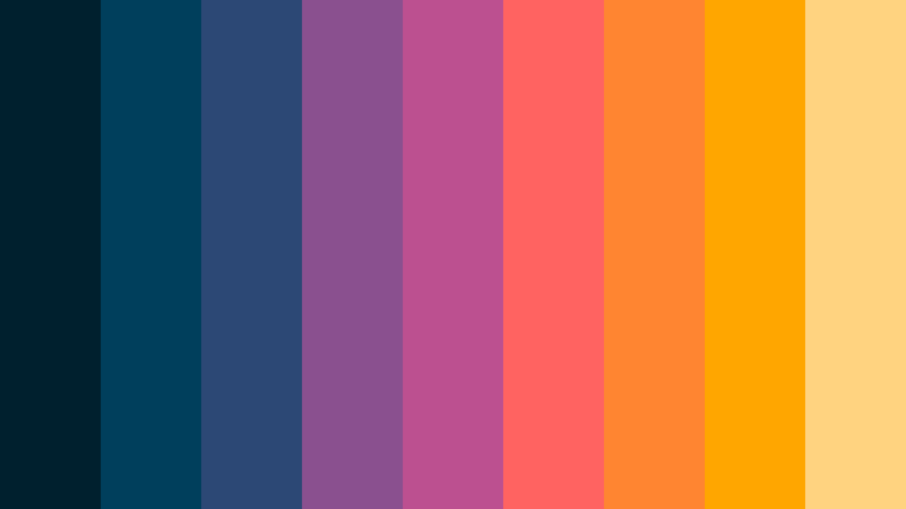
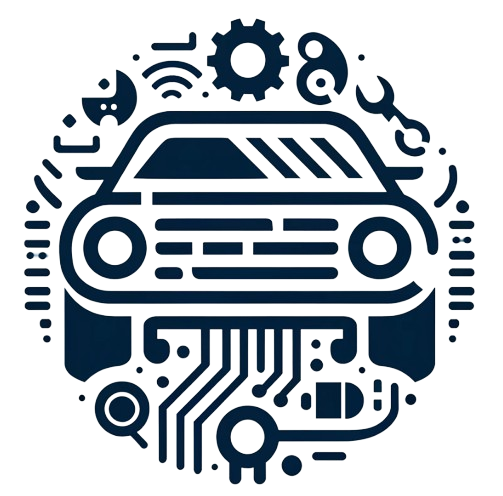
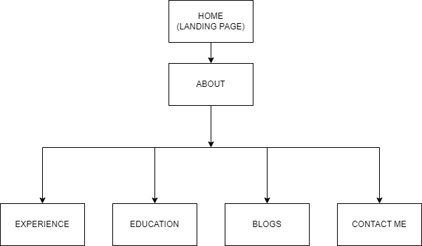
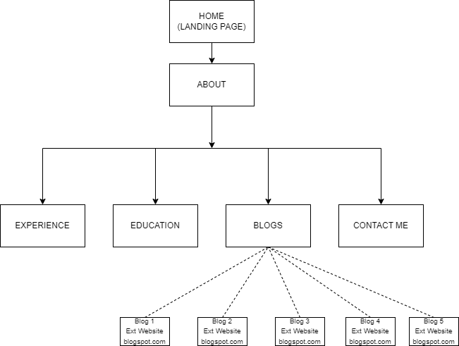
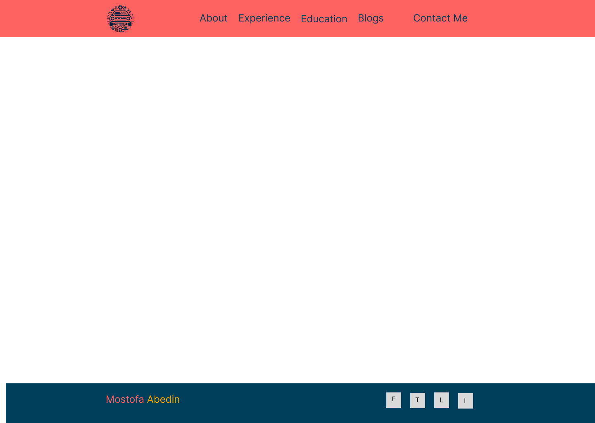
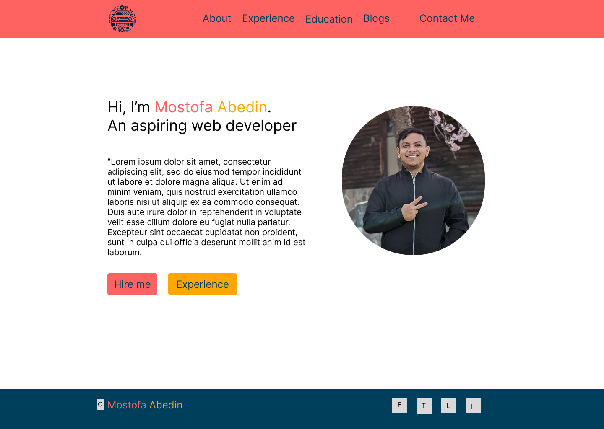
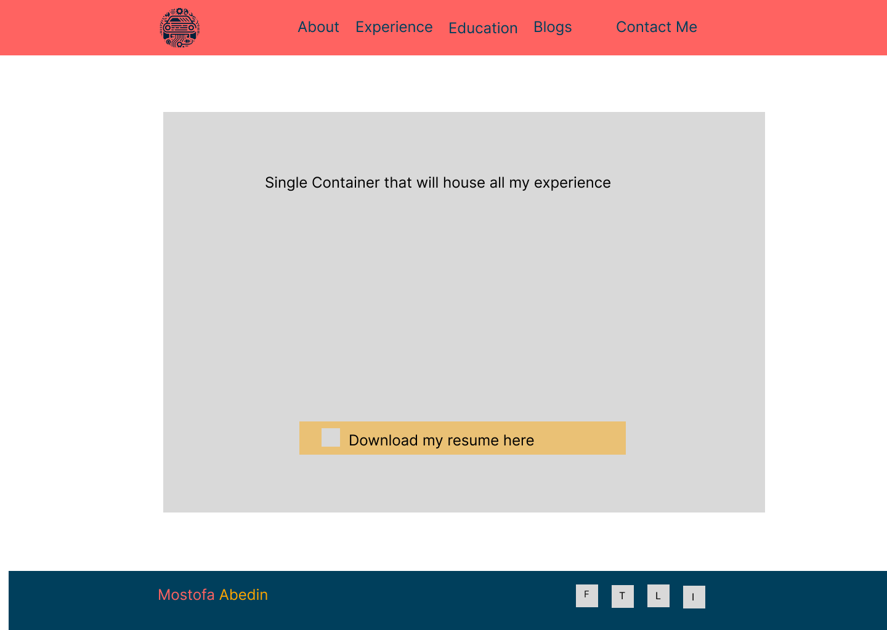
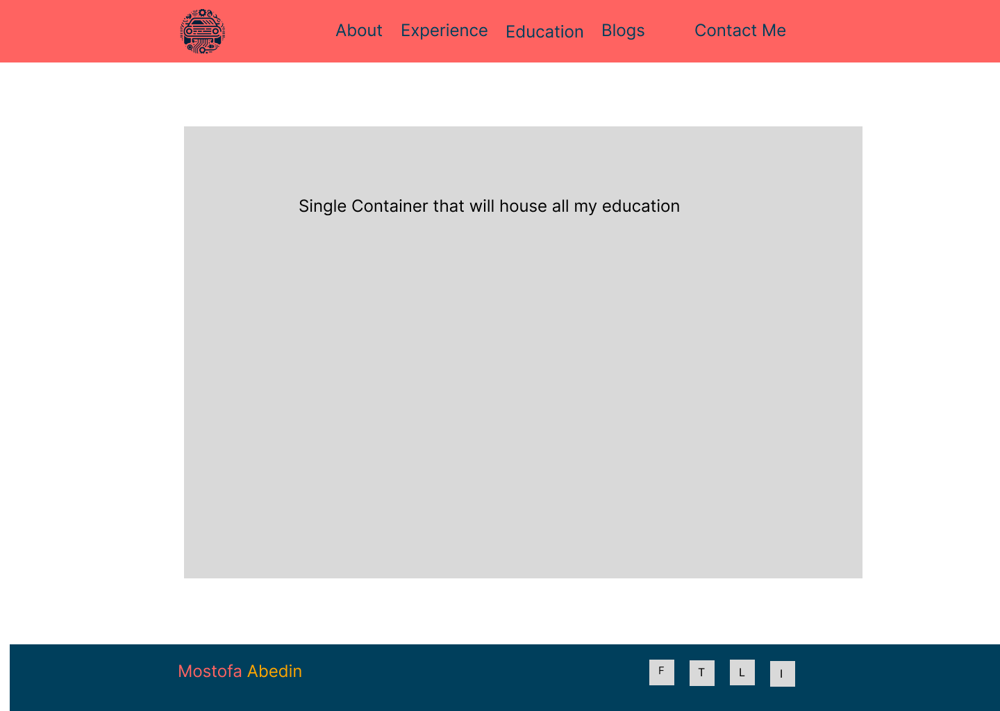
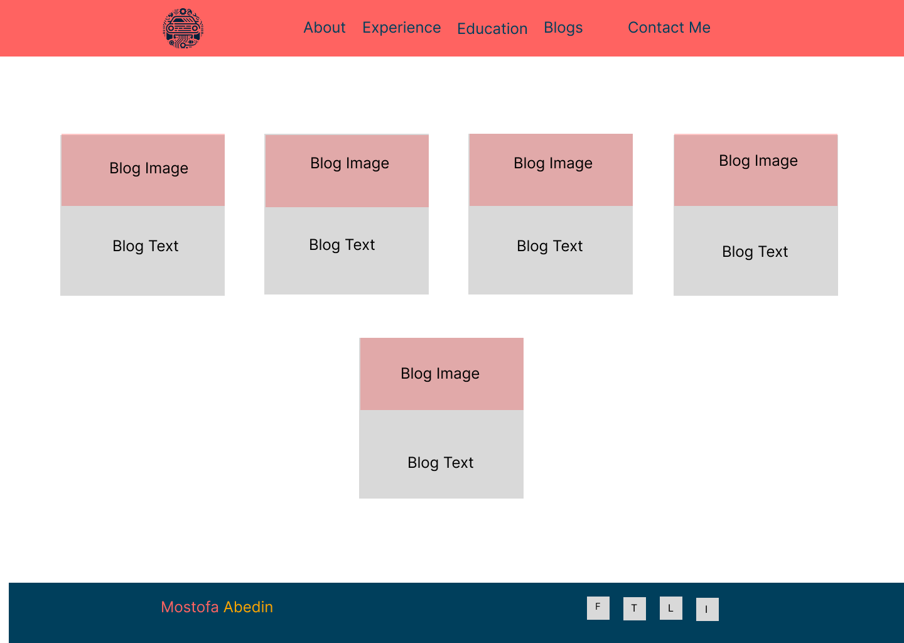
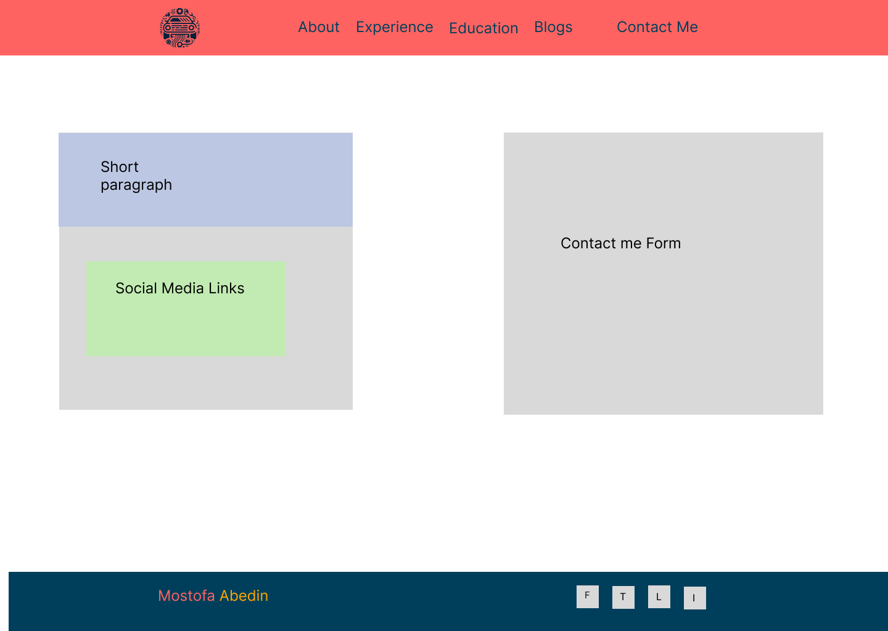

# <strong style="color:salmon"> About the Project </strong>
This project serves as part of the fulfillment of T1A2: Portfolio towards a Diploma of Information Technology at Coder Academy.

## Important Links 

Link to live website: https://mostofaportfolio.netlify.app/

Link to git repository: https://github.com/Mostofa-Abedin/-ShekhMostofaAbedin-_T1A2.git

## Built with

HTML and CSS Written using VSCode.
Deployed using Netlify. 

## Purpose

The aim of this project is to create the foundations for a personal portfolio that can be presented to future employers. A portfolio is a dynamic resume that allow potential employers to interact and gain better insight into a future employers capabilities. With time, this website will become a comprehensive collection of my professional work, skills, and accomplishments in the fields of web development, technology, and automotive engineering. 

## Target Audience

My target audience will be potential future employers and clients. However, I am appealing to a niche sector. In general, I want to appeal to online web based companies that deal with the subject matter of Automotive data. Some great examples of target companies that fit this description include https://carsales.com.au and https://carsguide.com.au.

Since, I have limited web development experience, I wanted to showcase my knowledge about Mechanical engineering and experience in the automotive software develpment sector. This website is not my final portfolio and I anticipate that I will make several changes as I progess through this bootcamp. 

# <strong style="color:salmon">Component Research and Design</strong>

I began my design process by looking across several online resources and portfolios from other developers to draw inspiration. I also read the requirements of the assignment in question several times to ensure that my design met all the requirements. Some of the portfolios that I drew inspiration from have been provided below.

- https://www.adhamdannaway.com/about
- http://findmatthew.com/
- http://ejosue.com/

## Pages Brainstorm

I want my portfolio to showcase my personal branding and to reflect my style. My personal brading has always been about "studied Mechanical Engineer but experienced in the tech sector with a sprinkling of business knowledge from my entreprenurial pursuits". With that goal in mind, I decided on the webpages below along with their purposes. 

- Landing Page: First page to catch viewers attention. 
- About: Page to highlight personal branding and introduce myself.
- Experience: Page to highlight Tech Sector experience.
- Education: Page to highlight Mechanical engineering background.
- Contact Me: Page for interested parties to get in touch.

Being an amateur web developer, I do not have any web projects. This portfolio will be my first. Therefore, I decided not to have a projects section like most other web developers. I hope to add it in the future as I gain more experience. 

## Colour Palette

I read several articles when choosing a color palette. I really liked article in particular https://bootcamp.uxdesign.cc/the-psychology-of-color-in-ux-ui-design-63379d38838c

I wanted to make my portfolio very colourful to make it pop. I wanted to use a color palette that encompases the beautiful colours we see in the sky during a sunset.

I settled on the colour palette taken from the website below
 https://colorkit.co/palette/00202e-003f5c-2c4875-8a508f-bc5090-ff6361-ff8531-ffa600-ffd380/

## Logo

As Personal branding is important. I decided to use AI to generate a logo that combines the keywords 'coding', 'technology' and 'cars'. After several iterations I decided to use the logo shown below. I also removed the background from the logo and converted to png.

## Fonts and icons

There are several options for fonts availabe however I decided to use something from google fonts that looked visually appealing. The font that used can be found here https://fonts.google.com/specimen/Roboto

For my icons I decided to use font awesome as they have some basic and free icons readily available. Fonts were taken from https://fontawesome.com/

## Animations

Animations are important to make a website more visually pleasing and to keep the viewer engaged. Moreover it can demonstrate quality of work. 

I added animations on the fly while designing the website as this was the best time for trail and error. However, I kept my animations minimal and non intrusive.

- My website logo does a full 360 rotation when hovered over. 
- All my clickable buttons change color when hovered over. 
- My navigation buttons also expand in size along with colour change when hovered over.
- On the experience page, my download resume button also expands size along with colour change when hovered over.
- If any component is clickable, the cursor changes from an arrow to a pointer.
- On the contact me page form, the text boxes are given a blue border when clicked.

## Responsive design

Unfortunately in my coding process I left the responsive design to the last and started with a Desktop first approach. This decision led me to spend significant time correcting and to be honest I am still not completely satisfied. 

I coded for responsive design using the @Media query. 

I made the website responsive for only 3 types of devices. I only categorized by device width and not height. Coding for both would be far too complicated at this stage.

- Mobile phones with a mimimum width of 400px upto a maximum of 820px.
- Tablets and Medium screens with a mimimum width of 820px upto maximum of 1920px.
- Desktop and large screens with a minimum width of 1920px. 

## Site Maps

I decided to have a static landing page as the starting point. The Landing page has a has only one button. Clicking it takes you to the about page. The about page has a navigation bar on top which can be used to access the experience, education, blogs and contact me pages. Since the navigation bar is fixed and appears on all the other pages, it can be used to navigate to any other page on the website. If you want to go back to the landing page, you simply have to click on the logo on the top left. A site map has been shown below. I drew the sitemap using the website https://app.diagrams.net/

 

During the building and coding stage for the website, I added external links in the blogs website. The external links redirect to blogspot.com. I wrote a few blogs back in 2021 for another course that I did. Each individual blog has a "Title" and "Read More" button which redirects to their respective blogs on blogspot. An updated sitemap has been presented below.

 

## Wireframe design

For my wireframe design, I used figma.

My wireframes were very basic as I decided that I would make changes as I wrote the code for the pages and thought about the content.  

My wireframes are blend of both high and low fidelity. Since, I myself would be the one coding the website, I would simply create them in such a way that helps me with planning. I did not create them to reflect my final product. 

## Landing page

I decided to use a landing page and the inital wireframe that I decided to use has been shown below. The landing page was made to be static with a simple mission statement. I wanted the landing page to be very vibrant in order to catch the attention of my viewers. The backgorund was generated by AI using the color palette shown above. The keysword provided to the AI were 'sky','sunset' and'stars'. My landing page would have only one button that redirects to my actual portfolio.

## Common theme

First I needed to come up with a common theme for the website. I decided that for all my webpages, the header and the footer would not change. This decision was made for simplicity purposes. Like most common found on websites, the logo would go on the left corner, the navigation links on the left of the header. The foother would contain copyright information on the left end and social media icons on the right end.

The common theme I came up with is shown below. 

## About page

I wanted to keep my about page page simple. I decided to have simple paragraph that provides and overview of myself would go on the left and a picture on me would go on the left. The picture was made circular to make it mores aesthetic. 

The wireframe design that I came up with is shown below

## Experience page

I decided that my experience page with simply mirror the experience section of my resume. All the content of my resume would go into a single container on the webpage. I also added a link to donload my resume at the bottom of the page.

The wireframe design that I came up with is shown below

## Education page

I decided that my experience page with simply mirror the education section of my resume. All the content of my resume would go into a single container on the webpage. 

Later on while coding, I decided to add logos of all the institutions that I have attended as well. i also added some contextual images for my degree related projects.

The initial wireframe design that I came up with is shown below.

## Blogs page

blog page would have simple containers for each blog. A picture and brief intro of each blog would be shown. The blog boxes should be arranged in a neat row and should be able to wrap around to the next row.

The wireframe design that I came up with is shown below

## contact me page

For my contact me page I decided to have a simple form on the right side of the page and links to my social media on the left. When designing the wireframe, I did not yet decide on the contents of the of the form. 

The wireframe design that I came up with is shown below

