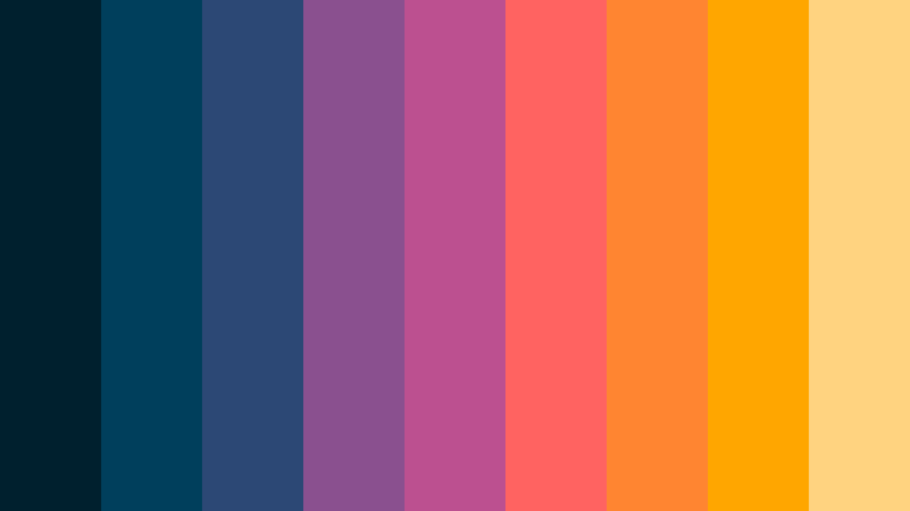
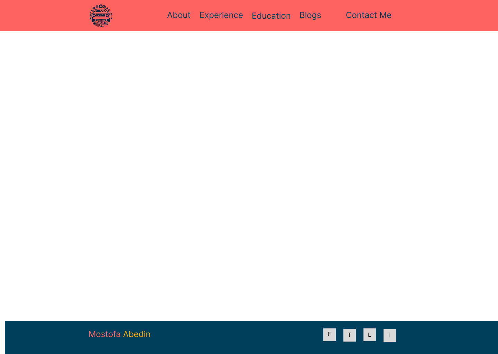
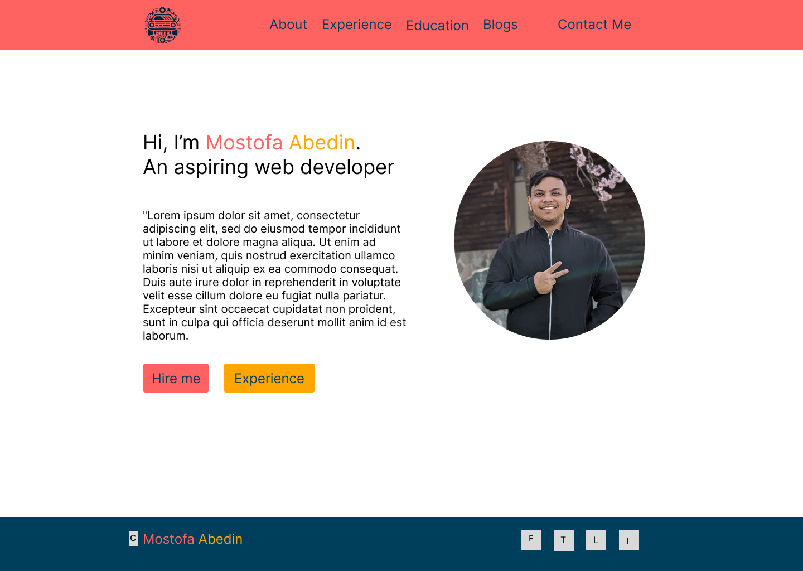
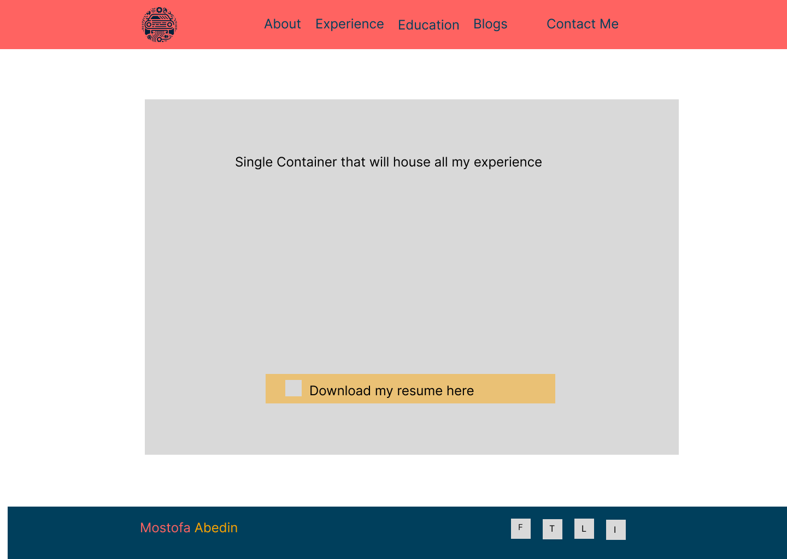
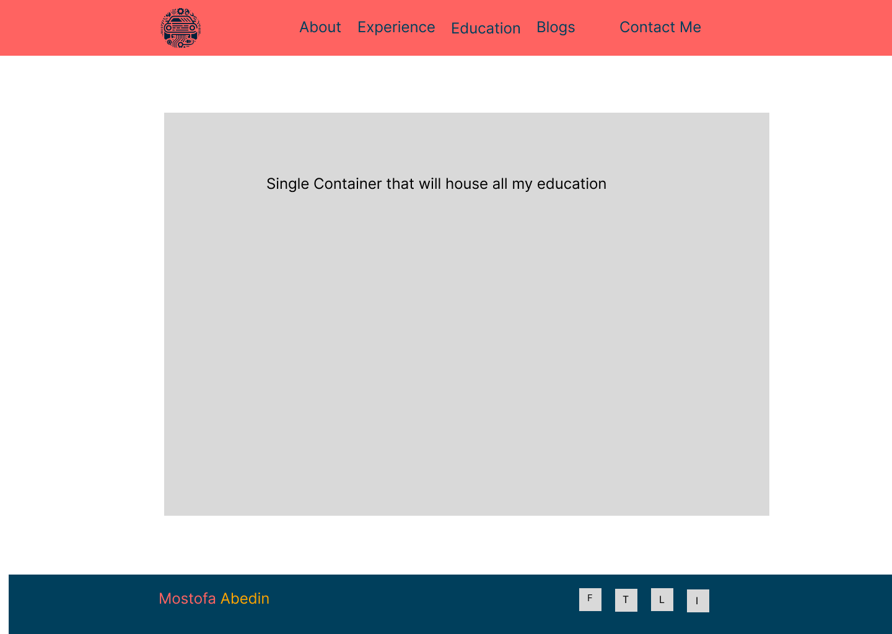
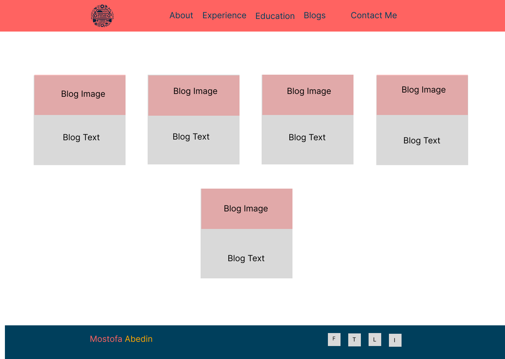
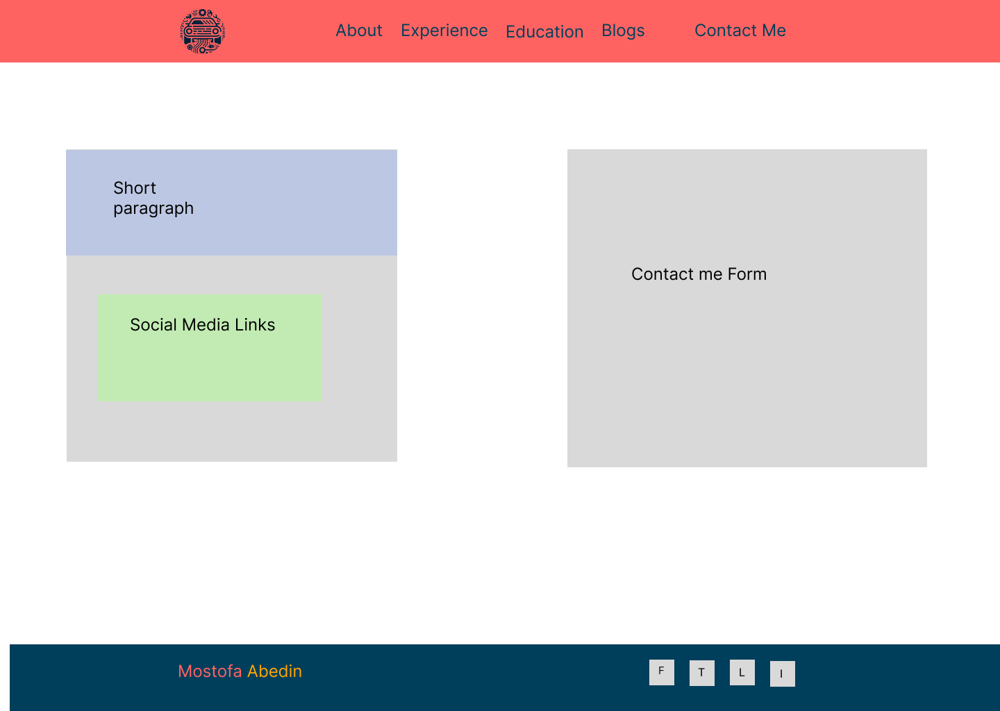

# About the Project

This Project is serves in the part the fulfilment of T1A2: Portfolio towards a Diploma of Imformation Technology at Coder Academy.  

The aim of this project is to create the foundations for a personal portfolio that can be presented to future employers.

### Important Links

Link to live website: https://mostofaportfolio.netlify.app/

Link to git repository: https://github.com/Mostofa-Abedin/-ShekhMostofaAbedin-_T1A2.git

### Built with

HTML and CSS Written using VSCode.
Deployed using netlify. 

# Research and Design Process

## Research

I began my design process by looking across several online resources and portfolios from other developers to draw inspiration. I also read the requirements of the assignment in question several times to ensure that my design met all the requirements. 

### Target Audience

My target audience will be potential future employers and clients. However, I am appealing to a niche sector. In general, I want to appeal to online web based companies that deal with the subject matter of Automotive data. Some great examples of target companies that fit this description include https://carsales.com.au and https://carsguide.com.au.

Since, I have limited web development experience, I wanted to showcase my knowledge about Mechanical engineering and having worked briefly in the automotive software develpment sector. This website is not my final portfolio and I anticipate that I will make several changes as I progess through this bootcamp. 

## Site Maps

After a lot of thought, I came up with the site map below. I designed to have a static landing page with bright colours to immediately catch the attention of my viewers. The Landing page 

I drew the sitemap using the website https://app.diagrams.net/

During the building and coding stage for the website, I added external links in the blogs website. The external links redirect to blogspot.com. I wrote a few blogs back in 2021 for another course that I did. Therefore, I decided to use those.

 An updated sitemap has been presented below.

### Colour Palette

I read several articles when choosinga color palette. Of all the articles I read, I really liked this one https://bootcamp.uxdesign.cc/the-psychology-of-color-in-ux-ui-design-63379d38838c

I wanted to make my portfolio very colourful to make it pop. I wanted to use a color palette that encompases the beautiful colours we see in the sky during a sunset.

I settled on the colour palette taken from the website below
 https://colorkit.co/palette/00202e-003f5c-2c4875-8a508f-bc5090-ff6361-ff8531-ffa600-ffd380/

### Logo

Personal branding is important. I decided to use AI to generate a logo that combines the keywords 'coding', 'technology' and 'cars'. After several iterations I decided to use the logo shown below. I also removed the background from the logo and converted to png.

## Wireframe design

For my wireframe design, I used figma. My wireframes were very basic as I decided that I would make changes as I wrote the code for the pages and thought about the content.  

My wireframes are blend of both high and low fidelity. Since, I myself would be the one coding the website, I would simply create them in such a way that helps me with planning. I did not create them to reflect my final product. 

### Landing page

I decided to use a landing page and the inital wireframe that I decided to use has been shown below

landing_page.png)

### Common theme
First I needed to come up with a common theme for the website. I decided that for all my webpages, the header and the footer would not change. The common theme I came up with is shown below. 

### About page

I wanted to keep my about page page simple. I decided to have simple paragraph that provides and overview of myself would go on the left and a picture on me would go on the left.

The wireframe design that I came up with is shown below

### Experience page

I decided that my experience page with simply mirror the experience section of my resume. All the content of my resume would go into a single container on the webpage. I also added a link to donload my resume at the bottom of the page.

The wireframe design that I came up with is shown below

### Education page

I decided that my experience page with simply mirror the education section of my resume. All the content of my resume would go into a single container on the webpage. 

The wireframe design that I came up with is shown below.

I decided to add logos of all the institutions that I have attended as well.

### Blogs page

M blog page would have simple containers for each blog. A picture and brief intro of each blog would be shown.

The wireframe design that I came up with is shown below

### contact me page

For my contact me page I decided to have a simple form on the right side of the page and links to my social media on the left. 

The wireframe design that I came up with is shown below

